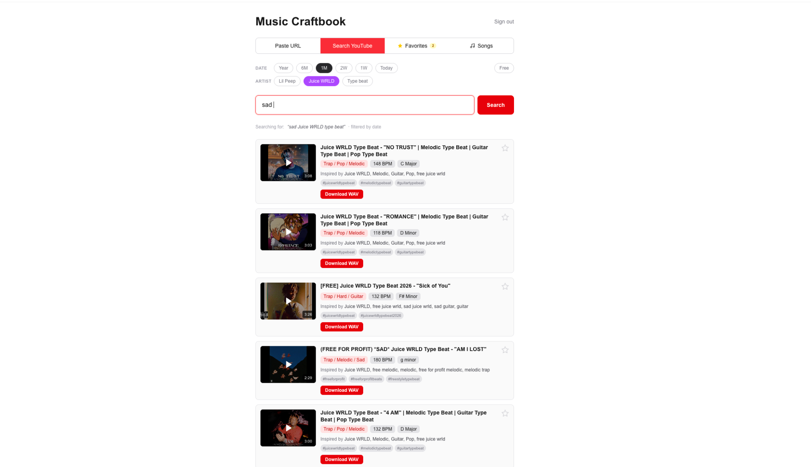
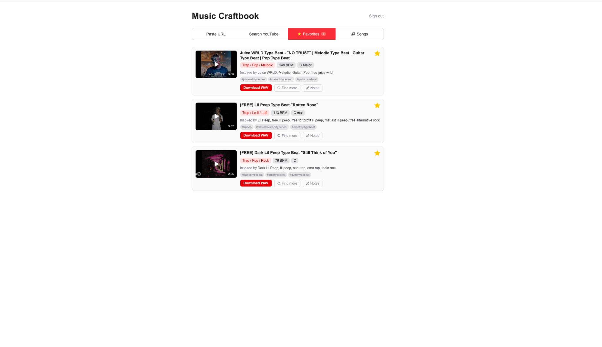
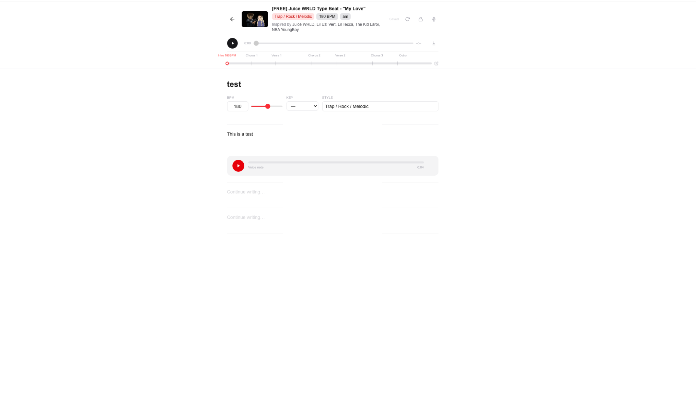
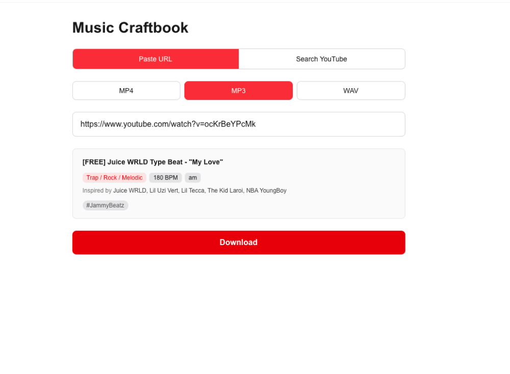
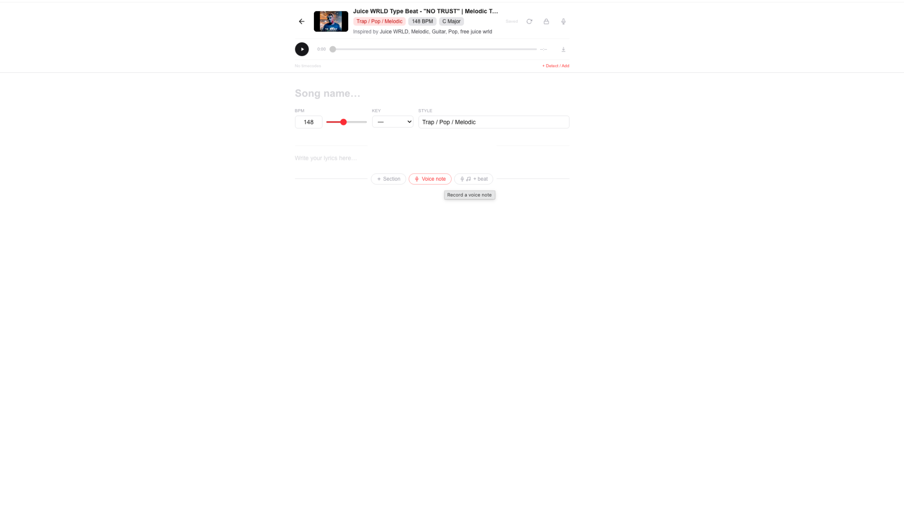
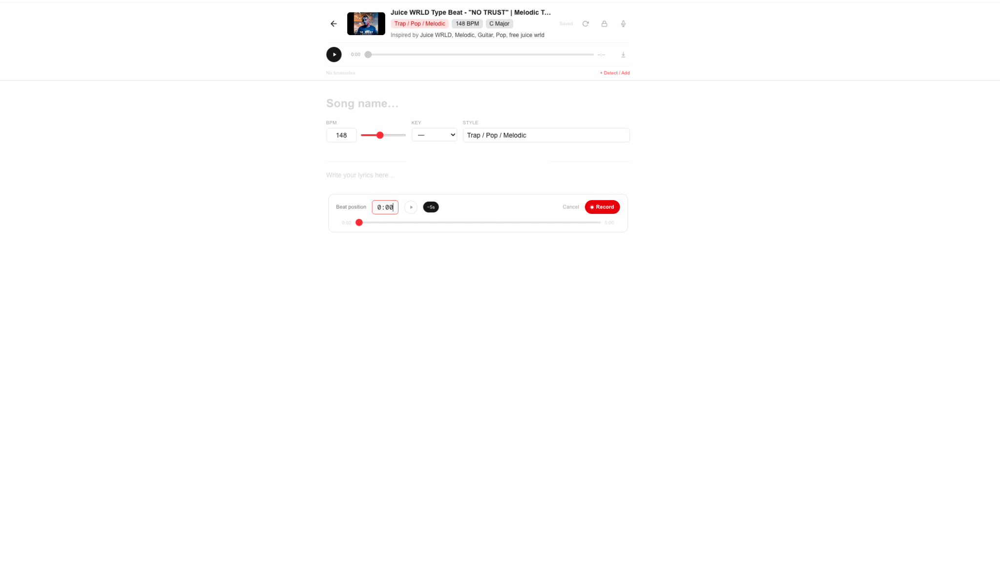
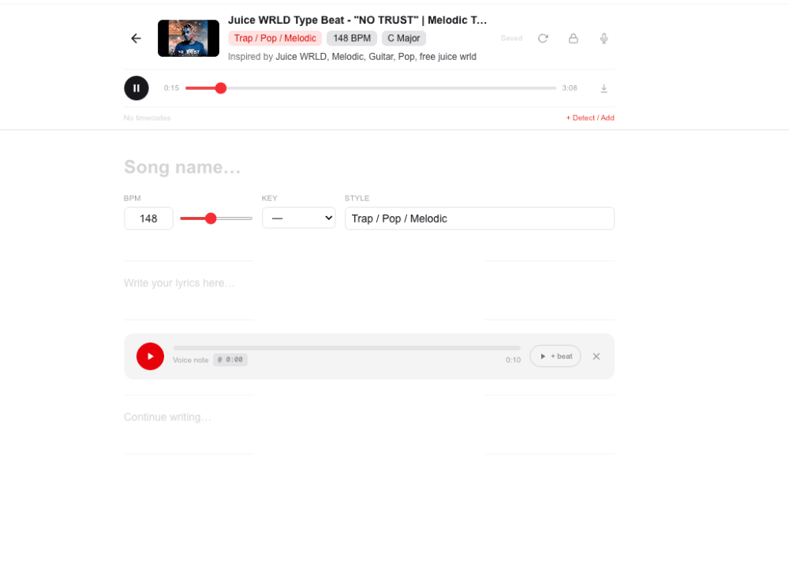
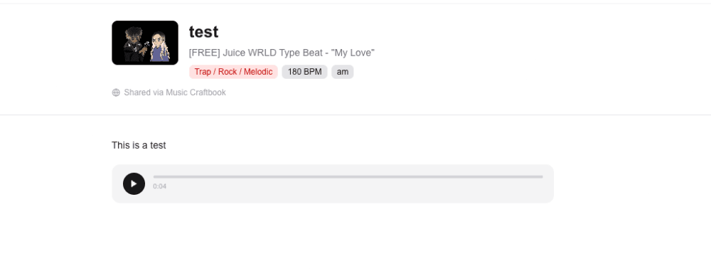

<div align="center">

# 🎧 Music Craftbook

**All-in-one workspace for writing over beats**  
Search • Write • Record • Sync • Share

[]()
[]()
[]()
[]()

</div>

---

## 🚀 What is Music Craftbook?

Music Craftbook is a **creative workspace for artists working with YouTube beats**.

It removes friction from your workflow by combining:

- 🎵 Beat discovery
- ✍️ Lyrics writing
- 🎙️ Voice recording
- ⏱️ Beat-synced ideas
- 🔗 Sharing

All in one place — so you stay in flow.

---

## ⚡ The Problem

Most workflows look like this:

- YouTube → find beats
- Notes app → write lyrics
- Voice memos → record ideas
- Messages → share progress

👉 Result: **fragmented, slow, and messy**

---

## ✅ The Solution

Music Craftbook unifies everything into a single interface:

```text
Find beat → Save → Write → Record → Sync → Share
```

---

## 🖼 Preview

### 🔍 Discover beats



### ⭐ Save and revisit



### ✍️ Write + record in sync



---

## 🔥 Core Features

### 🎵 Beat Search & Download

- Search YouTube with smart filters (type beats, artists, recency)
- Paste any video URL to analyze
- Extract:
  - BPM
  - Key
  - Beat type
  - Artist references
- Preview instantly
- Download as MP3 / WAV / MP4



---

### ⭐ Favorites

- Save beats with full metadata
- Persist search filters
- Jump back into the same context instantly


---

### ✍️ Notes & Lyrics Editor

- Mix text + voice blocks
- Auto-save
- Insert anywhere
- Clean writing interface



---

### 🎙️ Voice Recording

- Record directly inside the editor
- Instant playback
- Stored seamlessly



---

### ⏱️ Beat-Synced Voice Notes (✨ Key Feature)

Capture ideas exactly where they belong in the beat.

- Pick a timestamp
- Preview before recording
- Optional −5s lead-in
- Record in sync with playback
- Replay with beat perfectly aligned

👉 This replaces messy voice memos completely



---

### 🧭 Timecodes & Song Structure

- Auto-detect timestamps from YouTube descriptions
- Interactive timeline
- Live playhead
- Section labels (Intro, Verse, Hook…)
- Auto-tag recordings


---

### 🎧 Audio Device Control

- Select microphone input
- Route output to speakers / headphones
- Works directly in-browser

---

### 🔗 Sharing (🚀 Standout Feature)

Turn notes into a **shareable experience**:

- Public note pages
- Listen + read in sync
- Send one clean link

👉 Perfect for collaboration and feedback



---

## 🧱 Tech Stack

| Layer | Technology |
|------|-----------|
| Framework | Next.js 16 (App Router) |
| Language | TypeScript |
| Styling | Tailwind CSS |
| Database | PostgreSQL + Prisma |
| Auth | JWT (jose) + bcrypt |
| YouTube | yt-dlp |
| Audio | ffmpeg |
| Infra | Docker Compose |

---

## 🛠 Getting Started

### Prerequisites

- Docker
- Node.js 20+

### Run with Docker

```bash
docker compose up --build
```

App runs at:
```
http://localhost:3000
```

---

### Run locally

```bash
npm install
cp .env.example .env
npx prisma migrate deploy
npm run dev
```

---

## 🔐 Environment Variables

| Variable | Description |
|----------|------------|
| DATABASE_URL | PostgreSQL connection |
| JWT_SECRET | Auth secret |

---

## 🧠 Data Model

- **User** → owns notes + favorites
- **Favorite** → beat + metadata
- **Note** → structured blocks (text + audio)

---

## 🤝 Contributing

PRs, ideas, and feedback welcome.

---

## ⭐ Support

If this project helps you, drop a star 🙌

